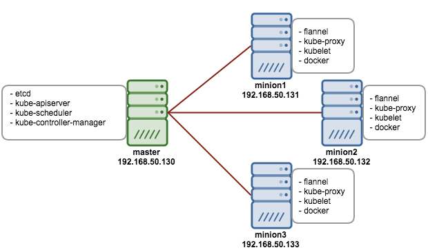

**What is Kubernetes?**
Kubernetes is a cloud application platform that sits at the highest level of abstraction.Its purpose is to provide a place for the containerized applications to live and managed or orchestrated

A cloud application platform. It makes deploying applications easier by automatically provisioning infrastructure. It automates operations.

- A cloud Platform
- Open Source
- Helps to automate DevOps tasks(deployments, scaling and management of the containerized applications)
- Helps organize containers into logical units (pods and nodes)
- relaunch applications that have failed (self-healing)
- Kubernetes will expose applications as services and will load balance requests between multiple app instances
- Usually installed on top of a public cloud IaaS provider such as AWS or Azure
- Also be installed in a hybrid cloud environment with nodes of a cluster spread out across a private data center(running OpenStack and vSphere) and spread across AWS
- While users can use Kubernetes on-premise or in the public cloud, the fully managed versions available provide great options

Abbreviation: k8s

Popular on-premise distributions: RedHat OpenShift

Popular fully managed Kubernetes offerings: Google GKE, AWS EKS

**Features:**

1. Automatic bin-backing: Kubernetes places containers automatically based on the required resources and other restrictions without impairing availability
2. Horizontal auto-scaling: Kubernetes can spin up and spin down new pods and nodes
3. Automated rollouts and rollbacks: In Kubernetes, deployments are versioned, facilitating graceful rollbacks
4. Storage orchestration: Kubernetes allows users to automatically mount a storage system of choice
5. Self-healing: Relaunches the applications that have failed
6. Service discovery and load-balancing: Kubernetes service discovery is an abstraction that enables a set of Pods to run using a single DNS name, and allows Kubernetes load balancing across them all.
7. Secret and configuration management

**Kubernetes Objects**

- "record of intent". Once created and stored, Kubernetes system will constantly work to ensure that the object exists.
- Persistent entites in the kubernetes system
- Used to represent the state of the cluster
- They describe:

  - What containerized applications are running and on which nodes
  - The resources available to those applications
  - The policies around how those applications behave, such as restart policies, upgrades and fault tolerance

- It is defined as a YAML configuration file with two main parts: spec and status which are the two nested object fields included in the object that govern the object's configuration

  - The spec describes your desired state for the object - the characteristics that you want the object to have

  - The status describes the actual state of the object and is supplied and updated by the kubernetes system

**Kubernetes Component Architecture**

_Kubernetes Master_

- The Kubernetes master component exposes the REST API that we can use to interact with the Kubernetes platform

- The master communicates with the Kubelet in each nodes to maintain the state of the cluster

- Kubernetes cluster means the master and its nodes

_Kubernetes Nodes_

- Each KNode can be either physical or a virtual host

- KNode contains Kubelet, a component and running process in the KNode

- All KNode must be running a Kubelet process to be considered KNode

_Users_

The users using the app sends HTTP requests that are resolved by the kube-proxy

_DevOps_

- The one who is interacting with the kubectl to create Kubernetes API objects and manage the cluster

- DevOps is interfacing the api-server to manage the cluster

Minion Node - Worker Node that participate in a kuberenetes cluster

Kube-apiserver - it exposes a REST API to which we can post Kubernetes objects to control the state of the cluster

etcd - It is a highly available key-value data store used by Kubernetes to store all the API objects(pod deployment) that we create via the kubectl cmd line or by calling the kube-apiserver

Kubelet - Primary "node agent" that runs on each node. It takes a set of PodSpecs that are provided through various mechanisms and ensures that the containers described in those PodSpecs are running and healthy

///

- Kubernetes has a master-slave architecture

- The core component of the Kubernetes master is the API server

- The Kubernetes nodes are vms where containers are deployed

- Each Kubernetes node features a Kubelet agent that maintains the state of the node and allows communication with the master via heartbeat msgs

**Google Kubernetes Engine**

Features:

- A managed, production-ready environment for deploying containerized applications

- Support for hardware accelerators to enable ML, GPU and other high-performance computing workloads

- Integration with Google Cloud build and container registry

- No vendor lock-in. It runs certified Kubernetes, ensuring portability across clouds and on-premise

- Fine-grained network policies and global VPC enable enterprises with strict security policies

- Autoscaling to handle increased user demand

- HIPAA and PCI DSS 3.1 compliant

- Runs on container-optimized OS, a hardened OS built and managed by Google

- Supports the Docker container format

**AWS EKS**

Features:

- Certified Kubernetes conformant - applications managed by EKS can be migrated to any standard Kubernetes environment

- Integrated with AWS CloudTrail to provide audit history and visibility into API calls to the Amazon EKS API

- Runs in an Amazon VPC, allowing VPC security groups and network ACLs so that no compute resources are shared with other customers

-IAM and Kubernetes native RBAC integration

- Provides an optimized AMI that includes NVIDIA drivers for GPU enabled P2 and P3 EC2 instances to enable ML and HPC workloads

- Project Calico network policy engine provides fine-grained networking policies to control access on a per service basis

- Compatibility with Kubernetes add-ons such as KubeDNS and kubectl

**Azure Kubernetes Service**

- Easily provision clusters via the Azure portal and Azure CLI, or with Infrastructure-as-a-code tools such as Azure Resources Manager and Terraform

- Boost application performance by routing traffic to the closest region using Azure traffic manager

- Operational visibility into your managed Kubernetes environment with control plane telemetry, log aggregation and container health automatically configured for AKS clusters

- Integrate Azure Active Directory with Kubenetes role-based access controls

- Safeguard cryptographic keys and other secrets used by Kubernetes master and agent nodes with key vault

- Secure your container network communication with custom virtual networks, Azure Container Network Interface(CNI) and network policy enforcement

- Iteratively develop, test and debug your containers using Azure dev spaces and VS, VSC or Azure CLI

- Integration with Azure DevOps provides a full CI/CD pipeline

- Integration with Azure container registry and geo-replication enables global deployments as one entity to simplify operations
